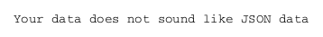

# API definition

---

## 1. Add item
Item should be of below abstraction.

```plantuml
@startjson
{
    "id": "uuid",
    "name": "String",
    "description": "String",
    "image": "String",
    "rate": "Double",
    "tags": ["String"]
    "discount": {
        "factor": "PERCENTAGE/FIXED/VARIABLE",
        "rate": [
            {
                "rate": "Double",
                "slab": "Integer"
            }
        ]
    }
}
@endjson
```

